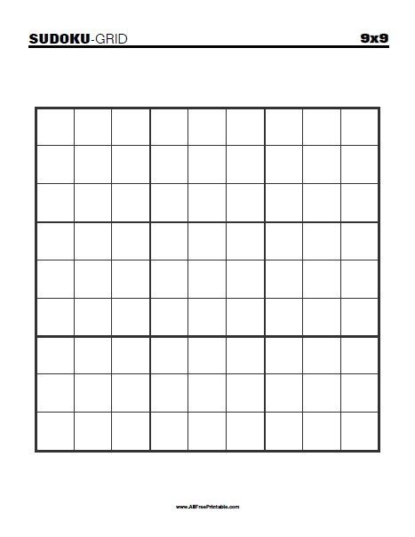

Project Name : Sudoku Solver using Backtracking algorithm

This project is an interactive Sudoku Solver built using Python and Pygame, featuring real-time visualization of the Backtracking algorithm. The solver uses optimized row, column, and box sets to validate moves efficiently and improve performance. Users can manually enter numbers, highlight cells, reset the puzzle, or load a default grid. The interface provides smooth interaction with error handling for invalid inputs and a clear, dynamic solving animation.

Tech Stack : 
Python ,
Data Structures & Algorithms ,
VS Code / Any Python IDE

Features:
Stack implementation with core operations (push, pop, peek, display)   , 
Backtracking-based problem solving using DLX (Dancing Links)   ,
Algorithmic implementation demonstrating efficient memory linking  ,
Console-based execution

How to Run the Project :
python STACKWITHBACK.py
python DLX.py

## Screenshot

